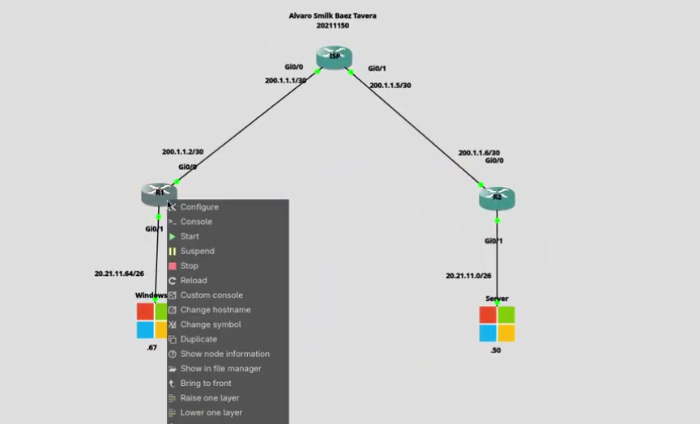
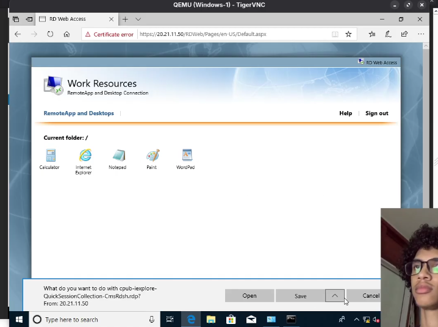
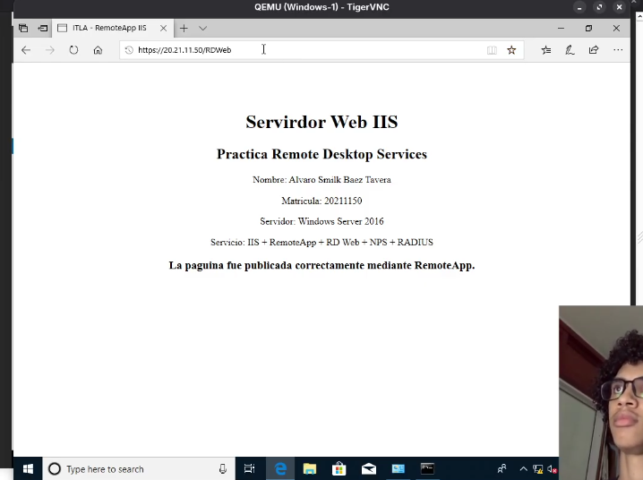
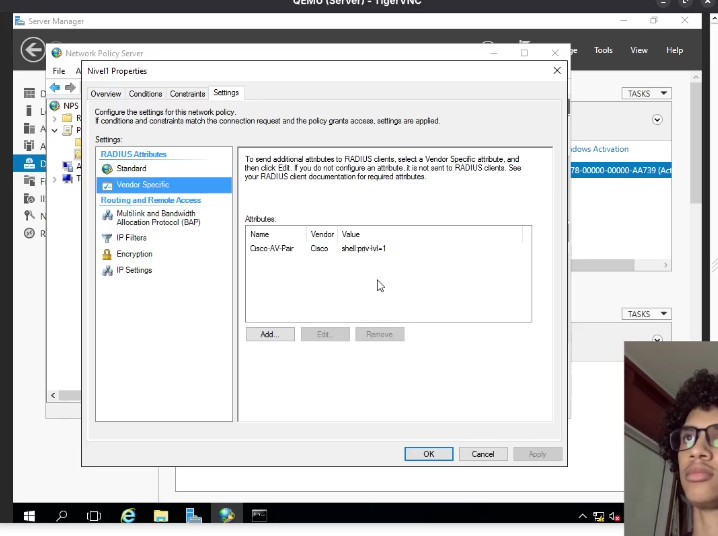
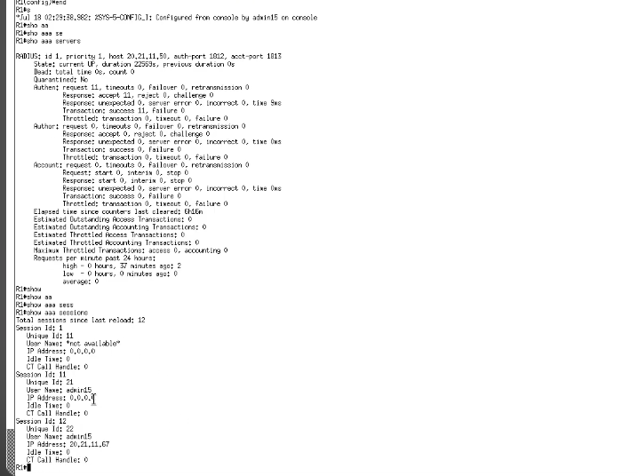
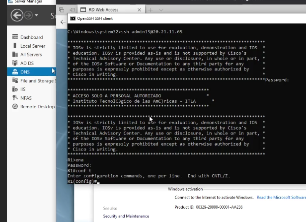
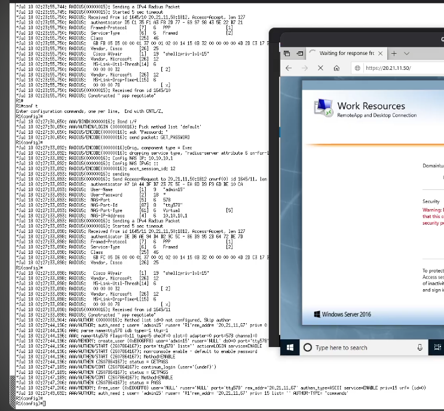

# Implementación de RDP RemoteApp, RD Web Access, IIS y NPS/RADIUS con AAA

## Datos del estudiante

- **Nombre:** Álvaro Smilk Báez Tavera
- **Matrícula:** 20211150
- **Institución:** Instituto Tecnológico de las Américas (ITLA)
- **Área:** Ciberseguridad

---

<div align="center">

## 🎥 Video Demostrativo

<p>
  Demostración del funcionamiento de RDP RemoteApp, RD Web Access, IIS,
  NPS/RADIUS, AAA y autenticación mediante SSH.
</p>

<a href="https://youtu.be/C0146iTGkFA" target="_blank">
  
</a>

<br>

<a href="https://youtu.be/C0146iTGkFA">
  <strong>Ver video demostrativo en YouTube</strong>
</a>

<br><br>

<strong>Duración aproximada: 4 minutos</strong>

</div>

---

## 📋 Descripción del proyecto

---

## Descripción del proyecto

Este proyecto presenta la implementación de una infraestructura de red orientada a la administración remota, publicación de aplicaciones y autenticación centralizada utilizando Windows Server y routers Cisco.

La práctica integra diferentes tecnologías y servicios, entre ellos Remote Desktop Services (RDS), RDP RemoteApp, RD Web Access, Internet Information Services (IIS), Active Directory Domain Services (AD DS), DNS y Network Policy Server (NPS).

Además, se implementó NPS como servidor RADIUS para centralizar la autenticación de los usuarios que acceden administrativamente a los routers Cisco mediante SSH. Los routers utilizan el modelo AAA (Authentication, Authorization and Accounting) para gestionar el acceso de los usuarios.

La infraestructura permite demostrar el acceso a aplicaciones publicadas mediante RemoteApp, el acceso a una página web personalizada alojada en IIS y la autenticación de usuarios en dispositivos Cisco utilizando RADIUS.

---

## Objetivo general

Implementar una infraestructura que integre servicios de acceso remoto, publicación de aplicaciones, alojamiento web y autenticación centralizada mediante Windows Server, NPS/RADIUS y dispositivos Cisco.

---

## Objetivos específicos

- Configurar Remote Desktop Services en Windows Server.
- Configurar y publicar aplicaciones mediante RDP RemoteApp.
- Implementar RD Web Access para acceder a las aplicaciones publicadas.
- Instalar y configurar Internet Information Services (IIS).
- Crear una página web personalizada.
- Permitir la consulta de la página IIS mediante los servicios implementados.
- Configurar Active Directory Domain Services.
- Configurar DNS para la resolución de nombres dentro del dominio.
- Integrar el equipo cliente Windows al dominio.
- Instalar y configurar Network Policy Server (NPS).
- Configurar NPS como servidor RADIUS.
- Registrar los routers Cisco como clientes RADIUS.
- Configurar grupos para nivel de acceso 15 y nivel de acceso 1.
- Implementar AAA en los routers Cisco.
- Crear un usuario local como método alternativo de autenticación.
- Configurar una contraseña para el modo privilegiado.
- Configurar acceso remoto mediante SSH.
- Verificar los procesos de autenticación y autorización AAA.

---

## Tecnologías utilizadas

- Windows Server
- Windows 10
- Active Directory Domain Services (AD DS)
- DNS Server
- Internet Information Services (IIS)
- Remote Desktop Services (RDS)
- RemoteApp
- RD Web Access
- Network Policy Server (NPS)
- RADIUS
- AAA
- SSH
- Cisco IOS
- GNS3

---

## Topología de red

La infraestructura fue implementada utilizando GNS3 para la virtualización de los dispositivos de red.

La topología está compuesta por routers Cisco, un servidor Windows Server y un equipo cliente Windows.

El Windows Server funciona como servidor central de la infraestructura, proporcionando servicios de Active Directory, DNS, IIS, Remote Desktop Services y NPS/RADIUS.

El cliente Windows se utiliza para realizar las pruebas de acceso a los servicios publicados y las conexiones SSH hacia los routers.

### Evidencia



---

## Active Directory y DNS

Se configuró Active Directory Domain Services utilizando el dominio:

`itla.local`

El Windows Server utiliza la dirección IP:

`20.21.11.50`

El servicio DNS proporciona resolución de nombres dentro de la infraestructura. El cliente Windows fue configurado para utilizar el servidor DNS interno y posteriormente fue integrado al dominio `itla.local`.

---

## Remote Desktop Services, RemoteApp y RD Web Access

Se configuró Remote Desktop Services en Windows Server para proporcionar acceso remoto a aplicaciones.

Mediante RemoteApp se publicaron aplicaciones disponibles para los usuarios autorizados.

RD Web Access proporciona una interfaz web desde la cual el cliente puede visualizar y ejecutar las aplicaciones publicadas.

### Evidencia



---

## Internet Information Services (IIS)

Se instaló y configuró Internet Information Services (IIS) en Windows Server.

Como parte de la práctica se creó una página web personalizada alojada en el servidor. El funcionamiento de la página fue comprobado desde el equipo cliente y mediante los servicios implementados de RemoteApp.

### Evidencia



---

## NPS y RADIUS

Network Policy Server (NPS) fue configurado para funcionar como servidor RADIUS.

Los routers Cisco fueron registrados como clientes RADIUS utilizando un secreto compartido para establecer la comunicación con el servidor.

Se configuraron grupos de usuarios para diferenciar los niveles de acceso:

- **Nivel 15:** Usuarios con privilegios administrativos.
- **Nivel 1:** Usuarios con acceso limitado.

### Evidencia

Usuario Nivel 1



Usuario Nivel 15


---

## Configuración AAA

Los routers Cisco fueron configurados utilizando AAA para gestionar los procesos de autenticación y autorización.

RADIUS funciona como mecanismo principal de autenticación, mientras que la base de datos local del router proporciona un método alternativo en caso de que el servidor RADIUS no se encuentre disponible.

También se configuró una contraseña para acceder al modo privilegiado del router.

### Evidencia



---

## Autenticación mediante SSH

Desde el equipo cliente Windows se realizaron conexiones SSH hacia los routers Cisco utilizando usuarios autenticados mediante el servidor NPS/RADIUS.

El proceso de autenticación funciona de la siguiente manera:

`Cliente Windows → Router Cisco → AAA → RADIUS → NPS / Windows Server`

Esta prueba permite verificar la comunicación entre los diferentes componentes de la infraestructura y la autenticación centralizada.

### Evidencia



---

## Verificación de AAA y RADIUS

Para comprobar el funcionamiento de los procesos de autenticación, autorización y comunicación RADIUS se utilizaron los siguientes comandos:

```text
debug aaa authentication
debug aaa authorization
debug radius
show aaa servers
show aaa sessions
```

El comando `show aaa servers` permite comprobar el estado del servidor RADIUS y visualizar las solicitudes de autenticación procesadas.

Los comandos `debug` permiten observar en tiempo real los procesos de autenticación, autorización y comunicación entre el router y el servidor NPS/RADIUS.

Después de finalizar las pruebas de depuración se utiliza:

```text
undebug all
```

### Evidencia



---

## Pruebas realizadas

Durante la implementación se realizaron pruebas de conectividad y resolución DNS, acceso a RD Web Access, ejecución de aplicaciones mediante RemoteApp, acceso a la página personalizada de IIS, comunicación con el servidor NPS/RADIUS y autenticación mediante SSH.

También se utilizaron comandos de monitoreo y depuración para verificar el funcionamiento de AAA y RADIUS.

---

## Conclusión

La realización de esta práctica permitió implementar una infraestructura que integra servicios de acceso remoto, publicación de aplicaciones, alojamiento web y autenticación centralizada.

Mediante Remote Desktop Services, RemoteApp y RD Web Access fue posible proporcionar acceso remoto a las aplicaciones publicadas en Windows Server. IIS permitió alojar y consultar una página web personalizada dentro de la infraestructura.

Por otra parte, Network Policy Server fue utilizado como servidor RADIUS para centralizar las solicitudes de autenticación provenientes de los routers Cisco. La implementación de AAA permitió integrar los procesos de autenticación y autorización con el servidor RADIUS y proporcionar acceso administrativo mediante SSH.

Finalmente, los comandos de monitoreo y depuración permitieron comprobar la comunicación entre los routers y el servidor NPS/RADIUS y verificar el correcto funcionamiento de los servicios implementados.
